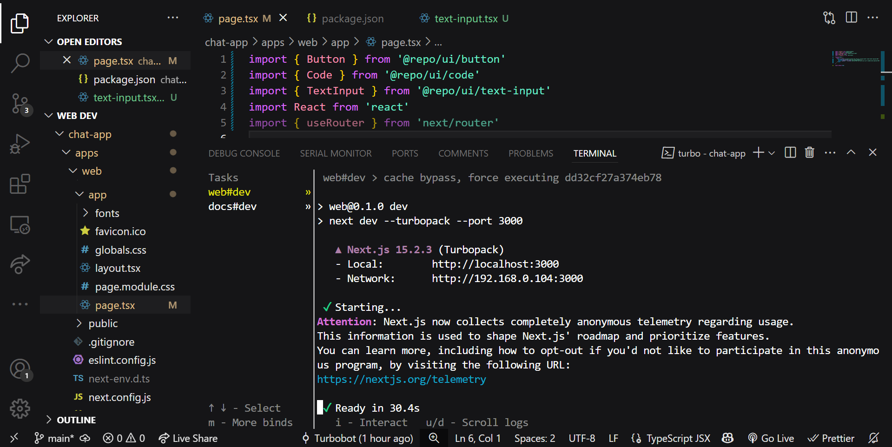

# A Concise Overview on Monorepos & Turborepo



## What's a Monorepo?
A monorepo (monolithic repository) is basically one big Git repo that holds multiple projects under the same roof. Unlike polyrepos (where every project has its own repo), a monorepo centralizes everything, making collaboration, code sharing, and dependency management way smoother.

## Why Even Use a Monorepo?
- **Shared Dependencies:** No more version mismatches across projects.
- **Consistent Tooling:** Linting, formatting, and builds stay uniform.
- **Better Code Sharing:** Reuse common utilities and libraries easily.

## Monorepo vs. Turborepo
While monorepos are great, they can get slow as they grow. Enter Turborepo—a tool that makes monorepos scalable by optimizing build speed, caching, and task orchestration.

Turborepos act more like a build system orchestor rather than a direct build system itself. Whereas, Monorepos is a version control strategy where multiple projects or services are stored in a single repo instead of having separate repositories stored for each project.

## How I Set Up a Turborepo-Based Monorepo
Here's exactly how I got Turborepo running on my local machine:

### 1. Install Turborepo

```bash
npx create-turbo@latest my-monorepo
cd my-monorepo
```

This sets up a clean monorepo structure with apps/ and packages/.

### 2. Add Your Projects
For example, if you're building a Next.js app and a shared UI library:

```bash
mkdir -p apps/web packages/ui
```

### 3. Install Dependencies
For a Next.js app with TypeScript:

```bash
cd apps/web
npm install next react react-dom typescript @types/react @types/node -D
```

For a shared UI package:
```bash
cd ../../packages/ui 
npm init -y
```

### 4. Configure turbo.json
Turborepo uses a turbo.json file to define tasks. Here's a simple one:

```json
{
     "tasks": {
          "build": {
               "dependsOn": [
                    "^build"
               ],
               "outputs": [
                    "dist/**"
               ]
          },
          "dev": {
               "cache": false
          }
     }
}
```

### 5. Run the Monorepo
Start the development environment:

```bash
turbo run dev --filter=web
```

This runs the dev script only for the web app—super handy when working on specific projects.

## Where & Why Monorepos Make Sense
### Best Use Cases
- Big Web Apps (like Google and Meta)
- Microservices keep multiple services in sync.
- Design Systems reuse UI components across apps.

### Why Monorepos Work
- Faster CI/CD with parallel builds and caching
- No dependency mismatches—everything stays in sync
- Easier collaboration across teams