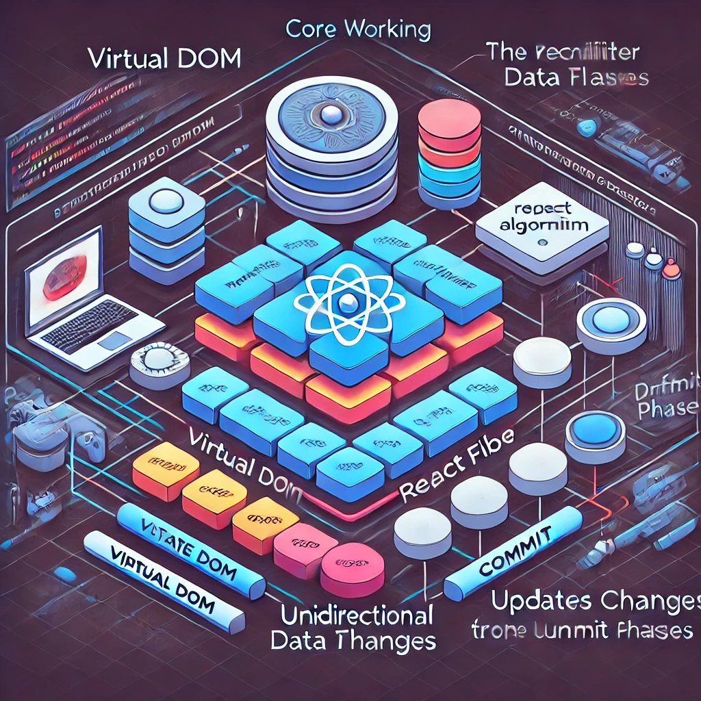

# Advanced React Patterns: Building Scalable Applications

React has become one of the most popular JavaScript libraries for building user interfaces due to its lightweight nature, ease of state management, and powerful features like hooks, routing, and more. But there's more to React than just what we see on the surface. Let's dive into the core architecture of React to understand how it works under the hood.

Do not concern the quality it's AI Generated

Understanding the Virtual DOM
At a high level, one of React's key innovations is its use of the Virtual DOM (VDOM). The VDOM is a lightweight, in-memory representation of the actual DOM. Instead of directly manipulating the DOM (which can be slow and inefficient), React creates a virtual copy of it. When the state of an application changes, React updates the virtual DOM first, calculates the differences (known as "diffing"), and then makes the minimal set of updates to the real DOM. This process improves performance significantly.

The React Architecture: Introducing Fiber
The secret sauce behind React's efficiency is its underlying architecture called React Fiber. Fiber is the algorithm that powers React's rendering engine. It handles how updates are processed and reflected on the UI, ensuring that the changes happen smoothly, even when dealing with complex or large-scale applications.

React Fiber enables React to break down rendering work into small units that can be paused, resumed, or even aborted. This is especially useful for maintaining a responsive user interface even when there are many changes happening in the background.

The Core Components of React Fiber
React Fiber consists of several key components that work together to make the update process efficient:

Reconciler: This is responsible for diffing, or comparing the new virtual DOM with the previous one to figure out what changed. It finds the most efficient way to update the real DOM based on those changes.

Diffing Algorithm: It is one of the most critical aspects of React's performance, which allows React to efficiently compare the old and new VDOM representations. Instead of a deep comparison, React uses heuristics to find the shortest and most optimal path to update the UI. This makes React much faster than traditional DOM manipulation techniques, where every change triggers a full re-render.

Commit Phase: Once the Reconciler has identified the changes, the commit phase updates the real DOM, applying only the necessary modifications. This phase ensures that only the parts of the DOM that have changed get updated, avoiding unnecessary re-rendering.

React's Unidirectional Data Flow
Another core aspect of React is its unidirectional data flow, which ensures that the state of an application always flows in one direction. Components receive data as props from their parent components and send data back up through events or callback functions. This structure helps maintain predictable state changes, making it easier to debug and reason about the application's behavior.

Hooks: Simplifying State and Lifecycle Management
One of the most exciting advancements in React is the introduction of Hooks. Hooks provide a way to manage state and side effects (like fetching data or manipulating the DOM) in functional components. They offer a cleaner and more concise way of writing React code without the need for class components. Popular hooks like useState and useEffect allow developers to manage the internal state and lifecycle of components seamlessly.

Wrapping Up
In summary, React's core strength lies in its efficient updating mechanisms, primarily enabled by the Virtual DOM and Fiber architecture. Through a combination of features like the reconciler, diffing algorithm, and hooks, React provides a powerful and flexible way to build fast, dynamic user interfaces. Understanding how React works under the hood can help you write more efficient, scalable code while appreciating the thoughtfulness behind its design.