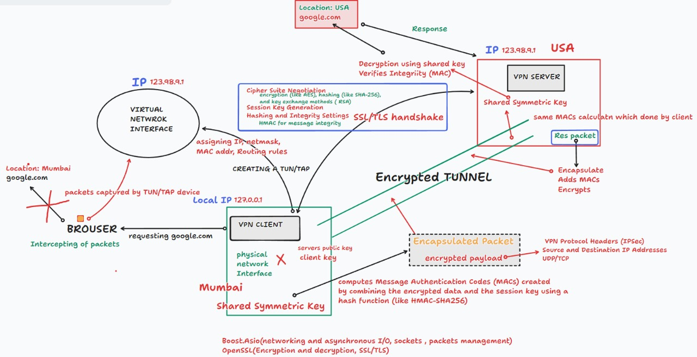

# Custom VPN Implementation: Understanding Secure Tunneling with TUN and OpenSSL

## Introduction

In today's digital landscape, privacy and security have become paramount concerns for individuals and organizations alike. With cyber threats on the rise and digital surveillance becoming increasingly pervasive, Virtual Private Networks (VPNs) have emerged as essential tools for maintaining confidentiality and protecting sensitive information online. While numerous commercial VPN solutions exist in the market, there's something uniquely empowering about understanding the inner workings of a VPN and potentially implementing your own custom solution.

This blog post delves into the fascinating world of custom VPN implementation using TUN interfaces and OpenSSL for secure tunneling. We'll explore the architecture, components, and principles behind creating a lightweight yet robust VPN solution that provides the security and privacy you need without relying on third-party services.



## Why Build Your Own VPN?

Before diving into the technical aspects, let's consider why someone might want to implement their own VPN solution rather than using readily available commercial options:

### Complete Control and Transparency
When you build your own VPN, you have full visibility into its operations. There's no mysterious "black box" handling your data – you know exactly how traffic is being routed, encrypted, and managed because you designed it yourself.

### Educational Value
The process of building a VPN provides invaluable insights into networking principles, encryption protocols, packet routing, and system administration. It's an excellent learning opportunity for those interested in cybersecurity and network engineering.

### Customization
Commercial VPNs offer limited options for customization. Building your own allows you to tailor every aspect of the VPN to your specific requirements – from encryption algorithms to routing policies.

### Cost-Effectiveness
While commercial VPN subscriptions may seem affordable individually, the costs accumulate over time. A self-hosted VPN requires an initial investment of time and potentially some minimal server costs, but can save money in the long run.

### Avoiding Trust Issues
Commercial VPN providers often claim "no-logs" policies, but users must ultimately trust these claims. With your own VPN, you control the logging policies and can be certain about what information is retained.

## Understanding VPN Fundamentals

### What is a VPN?

At its core, a Virtual Private Network creates an encrypted tunnel between your device and a server, through which all your internet traffic is routed. This provides several benefits:

1. **Privacy Protection**: Your ISP and other entities on your local network cannot view your browsing activities.
2. **Security on Public Networks**: Data transmitted over potentially insecure public Wi-Fi networks remains encrypted and protected.
3. **Bypassing Geographic Restrictions**: By connecting to servers in different regions, you can access content that might be geographically restricted.
4. **IP Address Masking**: Your original IP address is hidden from websites and services you access, replaced by the VPN server's IP address.

### How VPNs Work: The Basic Flow

The typical data flow in a VPN connection works like this:

1. You establish a connection to the VPN server.
2. A secure, encrypted tunnel is created between your device and the server.
3. Your data is encrypted before it leaves your device.
4. The encrypted data travels through the public internet to the VPN server.
5. The VPN server decrypts your data and forwards it to the intended destination.
6. Responses follow the reverse path – through the VPN server, encrypted, and back to your device.
7. Your device decrypts the incoming data.

This process ensures that your data remains encrypted while traveling over potentially insecure networks and that websites and services see the VPN server's IP address rather than your actual IP address.

## Key Components of Our Custom VPN

Our custom VPN implementation relies on several key components working together:

### TUN/TAP Virtual Network Interfaces

TUN (network TUNnel) and TAP (network TAP) are virtual network kernel drivers that simulate network devices in software rather than hardware. They are essential for implementing VPNs because they allow applications to capture and process network packets:

- **TUN**: Operates at the IP level (Layer 3 of the OSI model) and works with IP packets.
- **TAP**: Operates at the Ethernet level (Layer 2) and works with Ethernet frames.

For our VPN implementation, we'll focus on TUN interfaces since they provide everything we need while being simpler to work with for IP-based tunneling.

### OpenSSL for Encryption

OpenSSL is an open-source implementation of the SSL and TLS protocols, providing the cryptographic functionality needed for secure communications. In our VPN, OpenSSL handles:

- Secure session establishment
- Key exchange and management
- Data encryption and decryption 
- Certificate management for authentication

### Routing and Network Address Translation (NAT)

Proper routing configuration ensures that traffic is directed through the VPN tunnel. Network Address Translation (NAT) allows the VPN server to forward packets from the virtual network to the internet and vice versa.

## Architecture Overview

The architecture of our custom VPN solution can be visualized as follows:

```
+------------------+         +-------------------+         +------------------+
|    VPN Client    |         |    VPN Server     |         |  Internet/Target |
|                  |         |                   |         |                  |
| +-------------+  |   SSL   | +-------------+   |         |                  |
| |TUN Interface|  | Tunnel  | |TUN Interface|   |         |                  |
| |  (tun0)     |<--------->| |  (tun0)     |   |         |                  |
| +-------------+  |         | +-------------+   |         |                  |
|     ^           |         |        ^          |         |                  |
|     |           |         |        |          |         |                  |
| +-------------+  |         | +-----------+    |         |                  |
| |   Routing   |  |         | |   NAT     |    |         |                  |
| |   Table     |  |         | |   Rules   |    |         |                  |
| +-------------+  |         | +-----------+    |         |                  |
|     ^           |         |        ^          |         |                  |
|     |           |         |        |          |         |                  |
| +-------------+  |         | +-----------+    |   Raw   |                  |
| | Encryption  |  |         | | Encryption|    | Traffic |                  |
| | (OpenSSL)   |  |         | | (OpenSSL) |<----------->|                  |
| +-------------+  |         | +-----------+    |         |                  |
+------------------+         +-------------------+         +------------------+
```

This diagram illustrates the main components and data flow in our VPN implementation:

1. **Client-Side**: The application's network traffic is captured by the TUN interface, encrypted using OpenSSL, and sent through the SSL tunnel to the VPN server.

2. **Server-Side**: The server receives the encrypted data, decrypts it, and forwards the original packets to their destination on the internet.

3. **Return Path**: Responses from internet destinations are received by the server, encrypted, and sent back through the tunnel to the client.

Let's explore each part of this architecture in greater detail.

## Virtual Network Interfaces Deep Dive

### Understanding TUN/TAP Interfaces

Virtual network interfaces serve as the foundation of our VPN implementation. Unlike physical network interfaces (like Ethernet cards), these interfaces exist purely in software and allow applications to send and receive network packets.

#### TUN vs. TAP: A Detailed Comparison

| Feature        | TUN                    | TAP                    |
|----------------+------------------------+------------------------|
| OSI Layer      | Layer 3 (Network)      | Layer 2 (Data Link)    |
| Handles        | IP Packets             | Ethernet Frames        |
| Use Case       | Routing/VPN            | Network Bridging       |
| Header Size    | IP Header              | Ethernet Header        |
| Frame Type     | IP Packets Only        | All Ethernet Types     |

For our VPN implementation, TUN interfaces are preferable because:

1. We only need to route IP traffic, not all Ethernet traffic.
2. Processing at Layer 3 is more efficient as we don't need to handle Ethernet headers.
3. Configuration is simpler since we're working at the IP level.

### How TUN Interfaces Capture and Inject Packets

When you configure a TUN interface and set up routing to direct traffic through it, the following happens:

1. Applications on your system generate normal network requests.
2. The operating system's network stack processes these requests and creates IP packets.
3. Based on the routing table, packets matching the VPN routes are sent to the TUN interface.
4. Our VPN application reads these packets from the TUN interface (essentially capturing them).
5. After processing (encryption in our case), the VPN application can send these packets over a regular socket connection to the VPN server.
6. Similarly, packets received from the VPN server are injected back into the TUN interface, where the operating system processes them as if they arrived from a regular network interface.

This mechanism allows our VPN application to intercept and manipulate network traffic transparently to applications, which continue to function normally without any awareness that their traffic is being routed through a VPN.

## Encryption and Security

The security of our VPN relies heavily on proper implementation of encryption and authentication mechanisms. OpenSSL provides the cryptographic foundation for our secure tunnel.

### SSL/TLS Handshake Process

The establishment of a secure connection begins with the SSL/TLS handshake, which involves several steps:

1. **Client Hello**: The client initiates the connection and sends information about supported cipher suites and TLS versions.
2. **Server Hello**: The server responds with the selected cipher suite and its digital certificate.
3. **Certificate Verification**: The client verifies the server's certificate against trusted certificate authorities.
4. **Key Exchange**: The client and server perform a key exchange (typically using Diffie-Hellman) to establish a shared secret.
5. **Derive Session Keys**: Both sides derive symmetric encryption keys from the shared secret.
6. **Finished**: Both sides exchange encrypted "Finished" messages to verify the handshake was successful.

After this process, a secure channel is established for all subsequent communications.

### Encryption Components

#### Certificate Structure

For authentication purposes, our VPN uses X.509 certificates:

```
Root CA Certificate
    └── Server Certificate
        ├── Public Key
        ├── Subject (VPN Server Identity)
        └── Digital Signature
```

This structure allows the client to verify the server's identity before establishing a connection.

#### Cipher Suites

Modern secure VPNs should use strong cipher suites. For our implementation, we prefer:

- **Primary**: TLS_AES_256_GCM_SHA384 (for TLS 1.3)
- **Fallback**: TLS_CHACHA20_POLY1305_SHA256 (for hardware without AES acceleration)

These provide state-of-the-art security with excellent performance.

### Data Encapsulation Process

Once the secure channel is established, data flowing through the VPN undergoes several transformations:

```
+---------------------------+
|      Original Packet      |
+---------------------------+
           ↓
+---------------------------+
|       TLS Record         |
+---------------------------+
           ↓
+---------------------------+
|    Encrypted Payload     |
+---------------------------+
           ↓
+---------------------------+
|      UDP Datagram        |
+---------------------------+
```

This encapsulation ensures that the original packet is completely protected within the encrypted payload, which is then transmitted over the internet.

### Security Features

Our VPN implementation includes several advanced security features:

#### Perfect Forward Secrecy (PFS)

PFS ensures that if a long-term key is compromised in the future, it cannot be used to decrypt past communications. This is achieved by generating unique session keys for each connection using ephemeral Diffie-Hellman key exchange.

#### Certificate Pinning

To prevent man-in-the-middle attacks, the client can "pin" the server's certificate or public key hash, verifying it against a stored value rather than just checking if it's signed by a trusted CA.

#### Key Rotation Schedule

Regular key rotation enhances security by limiting the window of opportunity for attackers:

- Session Keys: Every 1 hour
- Master Keys: Every 24 hours
- Certificates: Every 90 days

## Network Flow and Routing

The effectiveness of a VPN relies heavily on proper network configuration and routing. Let's examine how traffic flows through our system.

### Understanding Network Address Translation (NAT)

NAT allows our VPN server to forward packets between different networks. There are several types of NAT used in our implementation:

1. **Source NAT (SNAT)**: Modifies the source address of packets, typically used when sending packets from the VPN network to the internet.
2. **Destination NAT (DNAT)**: Modifies the destination address, used for directing incoming responses back to the appropriate client.
3. **Masquerade**: A form of SNAT where the source address is set to the outgoing interface's address, ideal for situations with dynamic IP addresses.

### Routing Table Structure

Routing tables determine the path that packets take through the network. On the client side, a typical VPN routing table might look like:

```
Destination     Gateway         Genmask         Flags   Interface
0.0.0.0         10.8.0.1       0.0.0.0         UG      tun0
10.8.0.0        0.0.0.0        255.255.255.0   U       tun0
192.168.1.0     0.0.0.0        255.255.255.0   U       eth0
```

This configuration routes all traffic through the VPN tunnel (via tun0) except for local network traffic (192.168.1.0/24).

### Client-Side Network Flow

When you browse a website through our VPN, here's what happens on the client side:

1. Your browser makes a DNS request for the website's domain.
2. Due to the routing configuration, this request is directed to the TUN interface (tun0).
3. Our VPN client application reads the packet from tun0.
4. The client encrypts the packet using the established SSL/TLS session.
5. The encrypted packet is sent over the internet to the VPN server.

### Server-Side Network Flow

On the server side, the process continues:

1. The server receives the encrypted packet.
2. The packet is decrypted, revealing the original DNS request.
3. The server forwards this request to the appropriate DNS server.
4. When the DNS response arrives, the server encrypts it.
5. The encrypted response is sent back to the VPN client.
6. The client decrypts the response and writes it to the TUN interface.
7. Your operating system processes the response and delivers it to your browser.

This entire process is transparent to your applications, which operate as if they're communicating directly with the internet.

## Firewall Configuration

A properly configured firewall is crucial for VPN security. Our implementation includes detailed firewall rules to protect both the client and server.

### iptables Chains

Linux's iptables firewall uses chains to process packets:

```
                    ┌─────────────┐
                    │   Input    │
                    └─────────────┘
                          ↑
 ┌─────────────┐   ┌─────────────┐   ┌─────────────┐
 │  Incoming   │ → │  Forward   │ → │  Outgoing   │
 └─────────────┘   └─────────────┘   └─────────────┘
```

For our VPN, we configure specific rules in each chain to ensure secure operation.

### Basic Rules Structure

The foundation of our firewall configuration includes:

```
# Default policies
iptables -P INPUT DROP
iptables -P FORWARD DROP
iptables -P OUTPUT ACCEPT

# Allow established connections
iptables -A INPUT -m conntrack --ctstate ESTABLISHED,RELATED -j ACCEPT

# Allow VPN traffic
iptables -A INPUT -i tun+ -j ACCEPT
```

These rules establish a default-deny policy while allowing legitimate VPN traffic.

### VPN-Specific Rules

Additional rules specific to VPN operation include:

```
# Allow VPN port
iptables -A INPUT -p udp --dport 1194 -j ACCEPT

# Forward VPN traffic
iptables -A FORWARD -i tun0 -o eth0 -j ACCEPT
iptables -A FORWARD -i eth0 -o tun0 -m state --state RELATED,ESTABLISHED -j ACCEPT
```

These rules allow incoming connections to the VPN server and enable forwarding between the VPN network and the internet.

### Security Zones

Our firewall configuration establishes distinct security zones:

```
┌─────────────┐    ┌─────────────┐    ┌─────────────┐
│  Trusted    │ →  │    VPN     │ →  │ Untrusted   │
│  (Local)    │    │  (tun0)    │    │ (Internet)  │
└─────────────┘    └─────────────┘    └─────────────┘
```

This zoned approach provides clear boundaries and helps ensure that traffic flows securely between different trust levels.

## Setting Up and Running the VPN

Now that we understand the components and architecture, let's look at how to set up and operate our custom VPN solution.

### Prerequisites

Before implementing our VPN, ensure you have:

- A Linux operating system (Ubuntu/Debian recommended)
- Root privileges for network configuration
- OpenSSL development libraries
- TUN/TAP kernel module (included in most modern Linux kernels)

You can install the necessary packages with:

```
sudo apt-get update
sudo apt-get install build-essential libssl-dev
```

### Server Configuration

Setting up the VPN server involves several steps:

#### 1. Configure the TUN Interface

```
# Create and configure TUN interface
ip tuntap add dev tun0 mode tun
ip addr add 10.8.0.1/24 dev tun0
ip link set dev tun0 up
```

This creates a TUN interface with IP address 10.8.0.1, which will serve as the gateway for the VPN network.

#### 2. Enable IP Forwarding

```
sysctl -w net.ipv4.ip_forward=1
```

This allows the server to forward packets between the VPN network and the internet.

#### 3. Configure NAT

```
iptables -t nat -A POSTROUTING -s 10.8.0.0/24 -o eth0 -j MASQUERADE
iptables -A FORWARD -i tun0 -o eth0 -j ACCEPT
iptables -A FORWARD -i eth0 -o tun0 -m state --state RELATED,ESTABLISHED -j ACCEPT
```

These rules enable Network Address Translation, allowing clients to access the internet through the server.

#### 4. Generate Certificates

```
# Generate CA certificate
openssl genrsa -out ca.key 2048
openssl req -x509 -new -nodes -key ca.key -sha256 -days 3650 -out ca.crt \
    -subj "/C=US/ST=State/L=City/O=VPN-CA/CN=VPN Root CA"

# Generate server certificate
openssl genrsa -out server.key 2048
openssl req -new -key server.key -out server.csr \
    -subj "/C=US/ST=State/L=City/O=VPN-Server/CN=VPN Server"
openssl x509 -req -in server.csr -CA ca.crt -CAkey ca.key -CAcreateserial \
    -out server.crt -days 365 -sha256
```

These commands create the necessary certificates for secure authentication.

### Client Configuration

On the client side, configuration is somewhat simpler:

#### 1. Configure the TUN Interface

```
ip tuntap add dev tun0 mode tun
ip addr add 10.8.0.2/24 dev tun0
ip link set dev tun0 up
```

This creates a TUN interface with IP address 10.8.0.2, which will be the client's address on the VPN network.

#### 2. Configure Routing

```
# Save original default gateway
ip route show default | awk '{print $3
}' > /tmp/vpn_original_gateway

# Route traffic through VPN
ip route replace default via 10.8.0.1 dev tun0
```

These commands redirect all traffic through the VPN tunnel.

#### 3. Connect to the VPN Server

The client connects to the server, establishing the encrypted tunnel over which all traffic will flow.

### Running the VPN

Our implementation includes convenient scripts for starting and stopping the VPN:

#### Starting the Server

```
./run.sh server
```

This script:

- Cleans up existing TUN interfaces
- Generates SSL certificates if needed
- Enables IP forwarding
- Configures NAT
- Starts the VPN server on port 55555

#### Starting the Client

```
./run.sh client
```

This script:

- Creates and configures the TUN interface
- Connects to the VPN server
- Sets up routing through the VPN

#### Cleaning Up

```
./run.sh clean
```

This script restores the original network configuration, removing any changes made by the VPN.

## VPN Data Flow: A Visual Perspective

To better understand how our VPN works, let's visualize the complete data flow for a typical web request:

1. **Application Request:**
   - Your browser requests `google.com`
   - The operating system prepares an IP packet with destination `google.com`

2. **VPN Client Processing:**
   - Routing rules direct the packet to the TUN interface
   - The VPN client reads the packet from the TUN interface
   - The packet is encrypted using the SSL/TLS session
   - The encrypted packet is sent to the VPN server

3. **VPN Server Processing:**
   - The server receives and decrypts the packet
   - NAT rules modify the source address to the server's public IP
   - The packet is forwarded to the internet

4. **External Communication:**
   - `google.com` receives the request from the VPN server's IP
   - `google.com` responds to the VPN server

5. **Return Path:**
   - The server receives the response
   - NAT rules map the response back to the VPN client
   - The response is encrypted and sent through the tunnel
   - The client decrypts the response and writes it to the TUN interface
   - The operating system delivers the response to the browser

From the browser's perspective, this entire process is transparent - it simply appears as if the request and response traveled directly to and from `google.com`.

## Advanced VPN Configurations and Features

Our basic VPN implementation can be extended with advanced features for specific use cases:

### Split Tunneling

Split tunneling allows selected traffic to bypass the VPN while other traffic goes through it. This is useful for optimizing performance or accessing both local and remote resources simultaneously.

```
# Route only specific domains through VPN
ip route add 192.168.100.0/24 via 10.8.0.1 dev tun0
```

With this configuration, only traffic destined for 192.168.100.0/24 would go through the VPN, while all other traffic would use the original internet connection.

### Multi-hop VPN Configuration

For enhanced privacy, you can chain multiple VPN servers:

```
Client → VPN Server 1 → VPN Server 2 → Internet
```

This makes traffic analysis significantly more difficult, as no single server has complete visibility into both the source and destination of the traffic.

### DNS Leak Prevention

DNS leaks can compromise privacy even when using a VPN. To prevent this:

1. Force all DNS queries through the VPN tunnel
2. Use the VPN server's DNS or a secure DNS service
3. Block non-VPN DNS requests at the firewall level

```
# Redirect all DNS queries to VPN server
iptables -t nat -A OUTPUT -p udp --dport 53 -j DNAT --to 10.8.0.1: 53
```

### VPN Kill Switch

A kill switch prevents data leaks if the VPN connection drops unexpectedly:

```
# Block all traffic except VPN connection if VPN drops
iptables -A OUTPUT ! -o tun0 -m state --state NEW -j DROP
```

This rule blocks all new connections that aren't going through the VPN interface, ensuring that if the VPN fails, applications can't accidentally send data over the regular internet connection.

## Performance Optimization

Several factors can affect VPN performance. Here are strategies to optimize speed and efficiency:

### MTU Optimization

The Maximum Transmission Unit (MTU) affects how data is chunked for transmission. Finding the optimal MTU prevents fragmentation and improves performance:

```
# Set optimal MTU for VPN
ip link set dev tun0 mtu 1460
```

The ideal value is typically 1500 (standard Ethernet MTU) minus the overhead of the VPN encapsulation.

### Compression

For text-heavy traffic, compression can improve throughput:

1. Enable LZO or LZ4 compression for compatible traffic
2. Disable compression for already-compressed content (images, videos, encrypted data)

However, compression should be used cautiously as it can be vulnerable to certain attacks (like VORACLE).

### Protocol Selection

UDP typically offers better performance than TCP for VPN tunnels because:

1. No TCP-over-TCP meltdown issues
2. Lower overhead
3. No retransmission delays (which would be redundant with TLS)

### Connection Persistence

Maintaining a stable connection improves user experience:

1. Implement keepalive packets to prevent timeouts
2. Add auto-reconnect mechanisms for dropped connections
3. Use session resumption for faster reconnections

## Troubleshooting Common VPN Issues

Even well-designed VPNs can encounter problems. Here are common issues and their solutions:

### TUN/TAP Module Issues

```
# Check if TUN module is loaded
lsmod | grep tun

# Load TUN module if missing
sudo modprobe tun
```

### Network Configuration Problems

```
# Check interface status
ip link show tun0

# Verify IP configuration
ip addr show tun0

# Check routing table
ip route show
```

### Connection Failures

If the VPN fails to connect:

1. Verify the server is running and accessible
2. Check that the VPN port isn't blocked by firewalls
3. Validate certificates and authentication credentials
4. Look for clues in system logs

### Performance Degradation

If the VPN is slow:

1. Check network congestion between client and server
2. Verify CPU usage isn't limiting encryption performance
3. Experiment with different encryption algorithms or compression settings
4. Consider adjusting MTU settings

## VPN Use Cases

Our custom VPN implementation can serve various purposes:

### Remote Access

Securely access internal resources from outside your network:

- Corporate networks
- Home media servers
- Development environments

### Site-to-Site Connectivity

Connect multiple locations securely:

```
[ Office A
] ←→ [ VPN Tunnel
] ←→ [ Office B
]
```

This creates a unified network across geographically distributed locations.

### Enhanced Privacy

Protect your browsing habits from surveillance:

- ISP monitoring
- Public Wi-Fi snooping
- Tracking by websites

### Geo-Restriction Bypass

Access content that's restricted in your region:

- Streaming services
- News sites
- Research resources

### Securing IoT Devices

Route IoT device traffic through your VPN to:

- Monitor their communications
- Shield them from direct internet exposure
- Apply security policies centrally

## Security Best Practices

To ensure your VPN remains secure, follow these best practices:

### Certificate Management

1. Use strong keys (2048 bits minimum,
4096 bits recommended)
2. Implement proper certificate revocation processes
3. Rotate certificates regularly
4. Secure private keys with appropriate permissions

### Network Security

1. Use minimal firewall rules following the principle of least privilege
2. Regularly audit and update firewall configurations
3. Implement intrusion detection systems
4. Monitor for unusual traffic patterns

### Maintenance Procedures

1. Keep server software updated with security patches
2. Perform regular security audits
3. Maintain secure backups of configurations
4. Document all procedures and changes

## Comparing Custom VPNs to Commercial Solutions

| Aspect                 | Custom VPN                              | Commercial VPN                        |
|------------------------+----------------------------------------+--------------------------------------|
| Privacy Control        | Complete control over logging          | Depends on provider's policies       |
| Technical Knowledge    | Significant knowledge required         | Minimal knowledge needed             |
| Setup Complexity       | High initial setup effort             | Simple installation                  |
| Ongoing Maintenance    | Regular maintenance required          | Managed by provider                  |
| Cost                   | Server costs only                      | Monthly/yearly subscription         |
| Server Locations       | Limited to your deployments           | Multiple global locations           |
| Customization          | Fully customizable                     | Limited to provider's options       |
| Support                | Self-supported                         | Professional support available      |

## Real-World Deployment Considerations

When moving from a test environment to production, consider these factors:

### Scalability

If supporting multiple users:

1. Implement load balancing across multiple VPN servers
2. Monitor resource usage and scale accordingly
3. Optimize configurations for higher throughput

### High Availability

For mission-critical applications:

1. Deploy redundant VPN servers
2. Implement automatic failover mechanisms
3. Use monitoring systems to detect and respond to outages

### Monitoring and Logging

Effective monitoring helps maintain performance and security:

1. Set up centralized logging
2. Implement alerts for suspicious activities
3. Track performance metrics for optimization
4. Ensure compliance with relevant regulations

### Documentation

Comprehensive documentation is crucial:

1. Network diagrams and architecture descriptions
2. Configuration details and change history
3. Troubleshooting procedures
4. Disaster recovery plans

## Conclusion

Building a custom VPN using TUN interfaces and OpenSSL provides a powerful combination of security, privacy, and control. While it requires more technical knowledge than using commercial solutions, the benefits of complete transparency and customization make it appealing for those with specific requirements or an interest in network security.

Our implementation demonstrates how relatively simple components can be combined to create a robust security solution. The virtual network interfaces provide the foundation, OpenSSL handles the cryptographic heavy lifting, and proper routing and firewall configurations tie everything together into a cohesive system.

Whether you're motivated by privacy concerns, educational interest, or specific technical requirements, implementing your own VPN is a rewarding project that provides valuable insights into the inner workings of network security.

By understanding the principles outlined in this blog, you're well-equipped to begin exploring VPN implementation yourself. Start small, experiment in a controlled environment, and gradually build your understanding of each component. With patience and persistence, you can create a VPN solution tailored precisely to your needs.

## Further Reading and Resources

To deepen your understanding of VPN technologies and implementation, consider exploring:

1. **Linux Networking Documentation**: Detailed information on TUN/TAP interfaces, routing, and firewall configuration.
2. **OpenSSL Documentation**: Comprehensive guides to SSL/TLS implementation and certificate management.
3. **IETF RFC Documents**: Standards documents describing VPN protocols and security best practices.
4. **Network Security Communities**: Forums and discussion groups where you can share experiences and learn from others.

Remember that security is an ongoing process rather than a one-time setup. Stay informed about new vulnerabilities and best practices, and regularly review and update your VPN implementation to maintain its security and effectiveness.